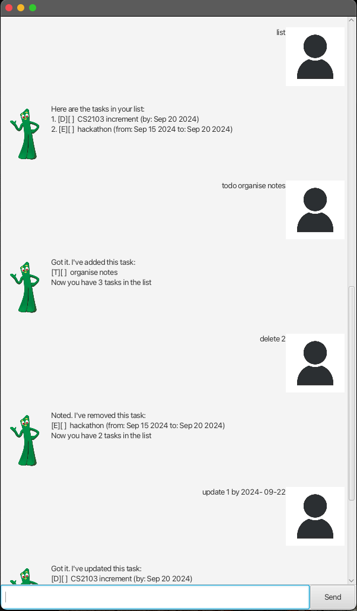

# Gumbo User Guide



Gumbo is a chatbot that allows you to manage your tasks, 
save them, and access them whenever you want.

## Adding a task to do

todo [description of task]

Example: `todo organise notes`

### Output

```
Got it. I've added this task:
[T][ ] organise notes
Now you have 1 tasks in the list
```
## Adding a task with a deadline

deadline [description of task] /by [deadline]

_note: deadline must be in ```yyyy-mm-dd``` format_


Example: `deadline assignment /by 2024-09-20`

### Output

```
Got it. I've added this task:
[D][ ] assignment (by: Sep 20 2024)
Now you have 2 tasks in the list
```
## Adding an event with a start and end data

event [description of event] /from [start date of event] /to [end date of event]

_note: start and end date must be in ```yyyy-mm-dd``` format_

Example: `event party /from 2024-09-15 /to 2024-09-20`

### Output

```
Got it. I've added this task:
[E][ ] party (from: Sep 15 2024 to: Sep 20 2024)
Now you have 3 tasks in the list
```
## Listing current tasks

list

### Output

```
Here are the tasks in your list:
1.[T][ ] organise notes
2.[D][ ] assignment (by: Sep 20 2024)
3.[E][ ] party (from: Sep 15 2024 to: Sep 20 2024)
```

## Marking or un-marking tasks

mark [index of task completed]

unmark [index of task not completed]

Example: `mark 1`

### Output

```
Here are the tasks in your list:
1.[T][X] organise notes
2.[D][ ] assignment (by: Sep 20 2024)
3.[E][ ] party (from: Sep 15 2024 to: Sep 20 2024)
```
`unmark 1`

```
Here are the tasks in your list:
1.[T][ ] organise notes
2.[D][ ] assignment (by: Sep 20 2024)
3.[E][ ] party (from: Sep 15 2024 to: Sep 20 2024)
```
## Deleting a task

delete [index of task]

Example: `delete 3`

### Output

```
Noted. I've removed this task:
[E][ ] party (from: Sep 15 2024 to: Sep 20 2024)
Now you have 2 tasks in the list
```

## Updating a task

update [index of task] [detail to update] [description to update]

Example: `update 1 description organise math notes  `

### Output

```
Got it. I've updated this task:
[T][ ] organise math notes
```

## Finding a task

find [any keyword from description of task]

Example: `find notes`

### Output

```
Here are the matching tasks in your list:
[T][ ] organise math notes
```

## Saving list of tasks to device

save


